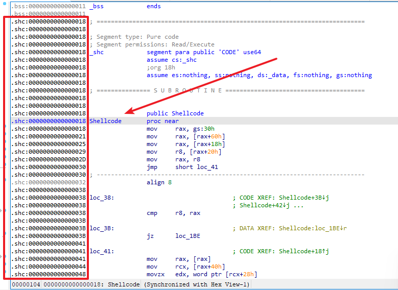
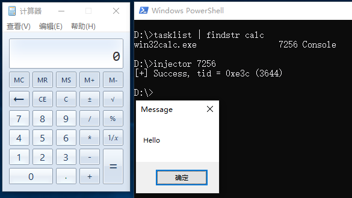

# 介绍

本仓库是一个使用 GCC 生成 Shellcode 的模板，仓库内共有四个模块：shellcode、hash、loader、injector。

**shellcode:** 编写Shellcode的主模块；

**hash:** 计算指定API名称的Hash值，方便从DLL中获取函数地址；

**loader:** 该模块主要用于测试Shellcode能否正常独立运行；

**injector:** 该模块主要用于测试Shellcode注入其他进程后能否正常独立运行。

# 原理

## 基本步骤

1. 利用 `__readgsqword/__readfsdword` 函数获取当前进程的PEB结构体地址；
2. 从PEB的模块链表中中寻找Kernel32.dll的基址；
3. 通过对比函数名Hash的方式，从Kernel32.dll中提取所需的函数；
4. 调用提取到的函数，实现所需功能。

## Shellcode编写流程

以弹出一个消息框的Shellcode为例，这里做出一点关于编写Shellcode的流程解释：

想要弹出消息框，我们就需要用到 `MessageBoxA` 函数，通过查询MSDN可以获得函数原型，以及得知了这个函数是位于 `User32.dll` 模块下的，因此一会调用 `MessageBoxA` 函数之前，还需要使用 `LoadLibraryA` 函数导入 `User32.dll` 模块。

一、首先将需要调用的函数名转换为Hash（通过仓库中的Hash模块）

```c
#define HASH_LoadLibraryA	0x071d2c76
#define HASH_MessageBoxA	0x4ce54ccf
```

二、从MSDN或者头文件源码中把函数声明原型提取出来

```c
typedef HMODULE(WINAPI* pfnLoadLibraryA)(_In_ LPCSTR lpLibFileName);
typedef int (WINAPI* pfnMessageBoxA)(
    _In_opt_ HWND hWnd,
    _In_opt_ LPCSTR lpText,
    _In_opt_ LPCSTR lpCaption,
    _In_ UINT uType);
```

三、使用 `GetProcAddrByHash` 提取函数地址（`GetProcAddrByHash` 具体实现看源码）

```c
pfnLoadLibraryA LoadLibraryA = (pfnLoadLibraryA)GetProcAddrByHash(Kernel32, HASH_LoadLibraryA);
pfnMessageBoxA MessageBoxA = (pfnMessageBoxA)GetProcAddrByHash(User32, HASH_MessageBoxA);
```

四、获得 `MessageBoxA` 函数地址后就可以调用了，最后完成的代码如下：

```c
VOID Shellcode()
{
    // Kernel32.dll
    typedef HMODULE(WINAPI* pfnLoadLibraryA)(_In_ LPCSTR lpLibFileName);

    // User32.dll
    typedef int (WINAPI* pfnMessageBoxA)(
        _In_opt_ HWND hWnd,
        _In_opt_ LPCSTR lpText,
        _In_opt_ LPCSTR lpCaption,
        _In_ UINT uType);

    // 获取 Kernel32.dll 模块
    HMODULE Kernel32 = GetKernel32Base();

    // 获取 Kernel32.dll 函数
    pfnLoadLibraryA LoadLibraryA = (pfnLoadLibraryA)GetProcAddrByHash(Kernel32, HASH_LoadLibraryA);

    // 载入 User32.dll 模块
    HMODULE User32 = LoadLibraryA("User32.dll");

    // 获取 User32.dll 函数
    pfnMessageBoxA MessageBoxA = (pfnMessageBoxA)GetProcAddrByHash(User32, HASH_MessageBoxA);

    // 弹框
    MessageBoxA(NULL, "Hello", "Message", MB_OK);
}
```

## 编译

使用 `gcc` 编译，将shellcode模块编译成 `.o` 文件：

> 编译为 `.o` 文件的好处是编译出来的的代码只包含Shellcode部分，不会编译出其他无关代码

> `-fno-asynchronous-unwind-tables` 参数的作用是避免生成一些与运行功能无关的代码

```
cd shellcode
gcc -c main.c -O3 -fno-asynchronous-unwind-tables
```

## Shellcode提取

编译上述代码得到 `.o` 文件后，将 `main.o` 通过IDA打开，定位至 `.shc` 代码段：



然后切换至十六进制视图，将有效的数据位提取出来：


## Shellcode测试

以 injector 模块为例，将上述提取到的代码填入 Shellcode 数组并编译，尝试注入计算器进程，结果如下：


