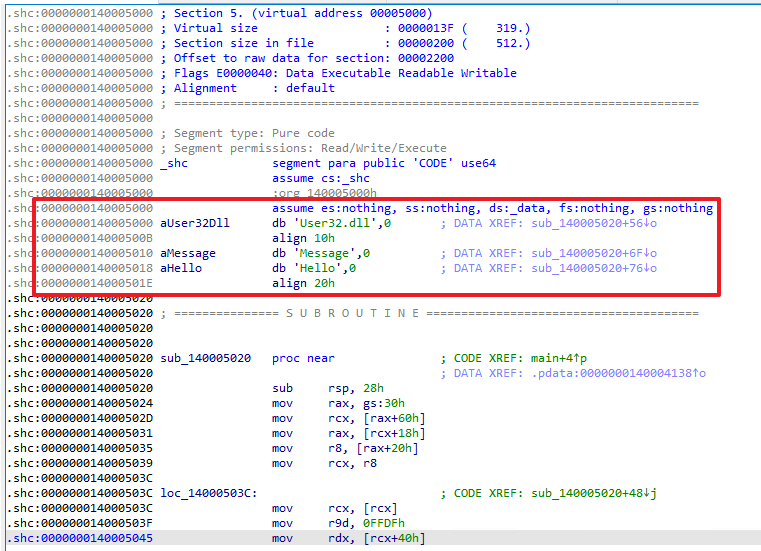
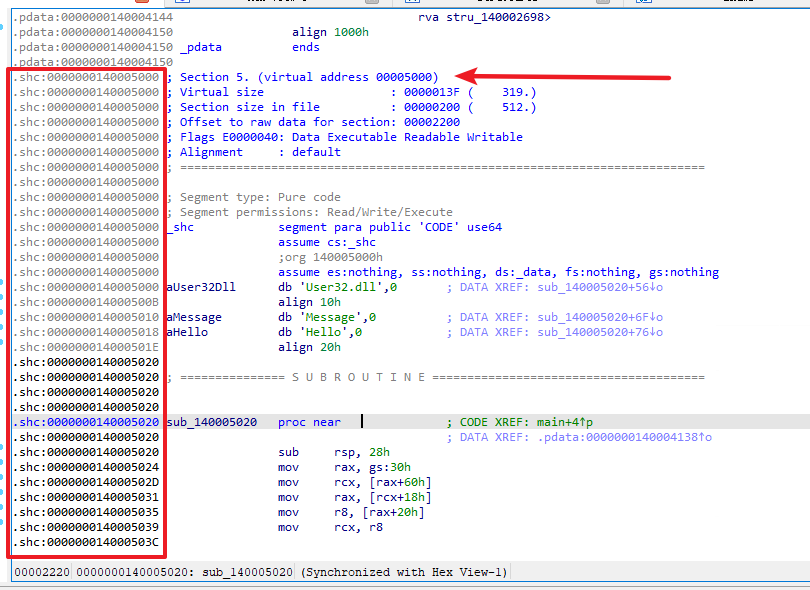
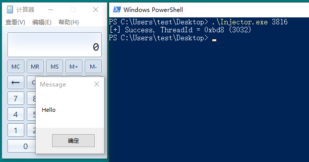

# 介绍

本仓库是一个 Shellcode 生成模板，仓库内共有四个模块：Shellcode、Hash、Loader、Injector。

**Shellcode:** 编写Shellcode的主模块；

**Hash:** 计算指定API名称的Hash值，方便从DLL中获取函数地址；

**Loader:** 该模块主要用于测试Shellcode能否正常独立运行；

**Injector:** 该模块主要用于测试Shellcode注入其他进程后能否正常独立运行。

# 原理

## 基本步骤

1. 利用 `__readgsqword/__readfsdword` 函数获取当前进程的PEB结构体；
2. 从PEB的模块链表中中寻找Kernel32.dll的基址；
3. 通过对比函数名Hash的方式，从Kernel32.dll中提取所需的函数；
4. 调用提取到的函数，实现所需功能。

## 注意事项

1. Shellcode是一段位置无关的代码，因此在调用Windows API时务必通过上述步骤获取函数地址再调用，以免出现地址冲突的异常；
2. 在声明一个字符串数组时，编译器有可能会自动帮助我们将数组字符全部置0，而所使用的函数正是`memset`，这种情况会导致提取的Shellcode无法运行，此时有两种方案，编译器禁用优化，或者避免声明字符串数组；
3. 由于我调整了编译器选项，代码段和数据段合并为了一个段（后面会有解释），代码中的字符串会被编译到代码段的头部，因此需要手动增加一个JMP指令，或者手动指定Shellcode入口



## 内存分布

为了方便提取Shellcode，这里设置了几个编译选项：

```
#pragma section(".shc", read, execute)
#pragma comment(linker, "/section:.shc,RWE")

#pragma data_seg(".dat")
#pragma comment(linker, "/merge:.dat=.shc")

#pragma const_seg(".rdat")
#pragma comment(linker, "/merge:.rdat=.shc")

__declspec(code_seg(".shc")) PVOID GetProcAddrByHash(HMODULE Module, DWORD Hash);
__declspec(code_seg(".shc")) VOID Shellcode();
```

这些选项表示：新建一个 `.shc` 代码段，并把 `GetProcAddrByHash` 和 `Shellcode` 函数都编译这个段中，然后把数据段和常量数据段与 `.shc` 段合并，从而实现代码和数据编译到同一个段，但是由于编译器默认把数据放置在代码前面，并且没有提供调整顺序的选项，我没办法对其进行调整。

## Shellcode编写流程

以弹出一个消息框的Shellcode为例，这里做出一点关于编写Shellcode的流程解释：

想要弹出消息框，我们就需要用到 `MessageBoxA` 函数，通过查询MSDN可以获得函数原型，以及得知了这个函数是位于 `User32.dll` 模块下的，因此一会调用 `MessageBoxA` 函数之前，还需要使用 `LoadLibraryA` 函数导入 `User32.dll` 模块。


一、首先将需要调用的函数名转换为Hash（通过仓库中的Hash模块）

```c
#define HASH_LoadLibraryA 0x071d2c76
#define HASH_MessageBoxA 0x4ce54ccf
```


二、从MSDN或者头文件源码中把函数声明原型提取出来

```c
typedef HMODULE(WINAPI* pfnLoadLibraryA)(_In_ LPCSTR lpLibFileName);
typedef int (WINAPI* pfnMessageBoxA)(
    _In_opt_ HWND hWnd,
    _In_opt_ LPCSTR lpText,
    _In_opt_ LPCSTR lpCaption,
    _In_ UINT uType);
```


三、使用 `GetProcAddrByHash` 提取函数地址（`GetProcAddrByHash` 具体实现看源码）

```c
pfnLoadLibraryA LoadLibraryA = (pfnLoadLibraryA)GetProcAddrByHash(Kernel32, HASH_LoadLibraryA);
pfnMessageBoxA MessageBoxA = (pfnMessageBoxA)GetProcAddrByHash(User32, HASH_MessageBoxA);
```


四、获得 `MessageBoxA` 函数地址后就可以调用了，最后完成的代码如下：

```c
VOID Shellcode()
{
    // Kernel32.dll
    typedef HMODULE(WINAPI* pfnLoadLibraryA)(_In_ LPCSTR lpLibFileName);

    // User32.dll
    typedef int (WINAPI* pfnMessageBoxA)(
        _In_opt_ HWND hWnd,
        _In_opt_ LPCSTR lpText,
        _In_opt_ LPCSTR lpCaption,
        _In_ UINT uType);

    // 获取 Kernel32.dll 模块
    HMODULE Kernel32 = GetKernel32Base();

    // 获取 Kernel32.dll 函数
    pfnLoadLibraryA LoadLibraryA = (pfnLoadLibraryA)GetProcAddrByHash(Kernel32, HASH_LoadLibraryA);

    // 载入 User32.dll 模块
    HMODULE User32 = LoadLibraryA("User32.dll");

    // 获取 User32.dll 函数
    pfnMessageBoxA MessageBoxA = (pfnMessageBoxA)GetProcAddrByHash(User32, HASH_MessageBoxA);

    // 弹框
    MessageBoxA(NULL, "Hello", "Message", MB_OK);
}
```

## Shellcode提取

编译上述代码后，将 `Shellcode.exe` 通过IDA打开，定位至 `.shc` 代码段：



然后切换至十六进制视图，将有效的数据位提取出来：


根据计算，Shellcode代码部分位于 `0x20` 的位置（绿色部分字节码），因此Shellcode的入口点就是 `0x20`。

## Shellcode测试

以 Injector 模块为例，将上述提取到的代码填入 Shellcode 数组，将入口点设置为 0x20，然后编译，运行结果如下：


