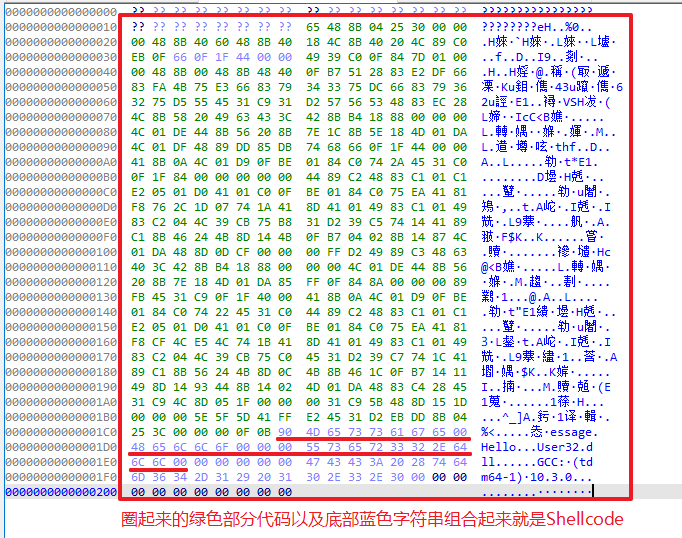

# 介绍

本仓库是一个使用 GCC 生成 Shellcode 的模板，仓库内共有四个模块：Shellcode、Hash、Loader、Injector。

**Shellcode:** 编写Shellcode的主模块；

**Hash:** 用于将API函数名转换为Hash值，Shellcode运行期间会使用该Hash值在DLL内存中搜索对应的API函数地址；

**Loader:** 该模块主要用于测试Shellcode能否正常独立运行；

**Injector:** 该模块主要用于测试Shellcode注入其他进程后能否正常运行。

# 原理

## 基本步骤

1. 利用 `__readgsqword/__readfsdword` 函数，读取获取当前进程的GS/FS寄存器，并找到PEB结构体地址；
2. 从PEB的模块链表中中寻找 `Kernel32.dll` 的基址；
3. 通过对比API函数名Hash的方式，在 `Kernel32.dll` 中找到 `LoadLibraryA` / `GetProcAddress` 等函数的地址；
4. 使用 `LoadLibraryA` / `GetProcAddress` 函数载入特定DLL及所需函数；
5. 调用提取到的函数，实现所需功能。

## Shellcode编写流程

这里简单解释一下如何使用本框架编写一个弹出消息框的Shellcode，大致需要实现的目标如下：

```
#include <Windows.h>

int main()
{
	// 导入 User32.dll
    HMODULE User32Dll = LoadLibraryA("User32.dll");

    // 获取 MessageBoxA 函数
    FARPROC MessageBoxA = GetProcAddress(User32Dll, "MessageBoxA");

    // 弹框
    MessageBoxA(NULL, "Hello", "Message", MB_OK);
    
    return 0;
}
```

使用本项目生成弹出消息框的Shellcode，需要进行以下操作：

**一、判断Shellcode需要调用哪些函数**

1. 观察上述C语言代码，弹出消息框需要用到 `MessageBoxA` 函数
2. 而 `MessageBoxA` 函数位于 `User32.dll` 模块，因此我们需要使用 `LoadLibraryA` 函数导入 `User32.dll` 模块
3. 随后，我们需要使用 `GetProcAddress` 函数，从 `User32.dll` 模块中导出 `MessageBoxA` 函数
4. 需要注意的是，在Shellcode中，我们不需要使用 `GetProcAddress` 函数，因为我们会使用自行编写的 `GetProcAddrByHash` 函数进行替代
5. 因此，我们需要调用的函数有 `LoadLibraryA` / `MessageBoxA`

**二、从MSDN或者头文件源码中把函数声明原型提取出来**

通过搜索MSDN，可以把上述所需的 `LoadLibraryA` / `MessageBoxA` 函数原型提取出来：

```c
typedef HMODULE(WINAPI* pfnLoadLibraryA)(_In_ LPCSTR lpLibFileName);
typedef int (WINAPI* pfnMessageBoxA)(
    _In_opt_ HWND hWnd,
    _In_opt_ LPCSTR lpText,
    _In_opt_ LPCSTR lpCaption,
    _In_ UINT uType);
```

**三、接着，我们编译Hash模块，将所需函数转换为Hash**

编译Hash模块：

```
cd Hash
gcc main.cpp -o hash.exe
```

计算`LoadLibraryA`/`MessageBoxA`函数的Hash值：

```
hash.exe LoadLibraryA
hash.exe MessageBoxA
```

最终获得对应函数的Hash值如下：

```c
#define HASH_LoadLibraryA	0x071d2c76
#define HASH_MessageBoxA	0x4ce54ccf
```

**四、准备工作结束后，我们开始编写Shellcode**

编写Shellcode的第一步就是要获取Kernel32.dll的地址，只有拿到该模块的地址，`GetProcAddrByHash` 函数才能工作

```
HMODULE Kernel32 = GetKernel32Base();
```

`GetKernel32Base()` 函数的原理是通过GS寄存器获得 `PEB` 结构体地址，并通过对比名字的方式，在 `PEB` 的DLL链中找到 `Kernel32.dll` 模块的地址

**五、使用 `GetProcAddrByHash` 找到 `LoadLibraryA` 函数地址**

拿到 `LoadLibraryA` 函数后，才能够载入其他DLL库

```c
pfnLoadLibraryA LoadLibraryA = (pfnLoadLibraryA)GetProcAddrByHash(Kernel32, HASH_LoadLibraryA);
```

**六、载入 `User32.dll` 并取出 `MessageBoxA` 函数**

```c
__attribute__((section(".str"))) const static char dll[] = "User32.dll";
HMODULE User32 = LoadLibraryA(dll);
pfnMessageBoxA MessageBoxA = (pfnMessageBoxA)GetProcAddrByHash(User32, HASH_MessageBoxA);
```

> 从代码中可以看到，需要用到字符串参数的时候，我们不能直接将字符串填充到函数参数里，因为这样字符串会被编译到距离Shellcode函数较远的位置，不方便后续Shellcode的提取

> 我把 `VOID Shellcode()` 函数放置在 `.shc` 段中，把字符串放置在 `.str` 段中，这两个段会被 GCC 编译到相邻的位置，而且 `.shc` 段在 `.str` 上方，这样极大的方便了Shellcode的提取

**七、调用 `MessageBoxA`**

```c
__attribute__((section(".str"))) const static char title[] = "Hello";
__attribute__((section(".str"))) const static char context[] = "Message";
MessageBoxA(NULL, title, context, MB_OK);
```

**八、最后完成的代码如下**

```c
#define HASH_LoadLibraryA	0x071d2c76
#define HASH_MessageBoxA	0x4ce54ccf

// Kernel32.dll
typedef HMODULE(WINAPI* pfnLoadLibraryA)(_In_ LPCSTR lpLibFileName);

// User32.dll
typedef int (WINAPI* pfnMessageBoxA)(
    _In_opt_ HWND hWnd,
    _In_opt_ LPCSTR lpText,
    _In_opt_ LPCSTR lpCaption,
    _In_ UINT uType);

__attribute__((section(".shc"))) VOID Shellcode()
{
    __attribute__((section(".str"))) const static char dll[] = "User32.dll";
    __attribute__((section(".str"))) const static char title[] = "Hello";
    __attribute__((section(".str"))) const static char context[] = "Message";

    // 获取 Kernel32.dll 模块
    HMODULE Kernel32 = GetKernel32Base();

    // 获取 LoadLibraryA 函数
    pfnLoadLibraryA LoadLibraryA = (pfnLoadLibraryA)GetProcAddrByHash(Kernel32, HASH_LoadLibraryA);

    // 载入 User32.dll 模块
    HMODULE User32 = LoadLibraryA(dll);

    // 获取 User32.dll 函数
    pfnMessageBoxA MessageBoxA = (pfnMessageBoxA)GetProcAddrByHash(User32, HASH_MessageBoxA);

    // 弹框
    MessageBoxA(NULL, title, context, MB_OK);
}
```

## 编译

使用 `gcc` 编译，将shellcode模块编译成 `.o` 文件：

> 编译为 `.o` 文件的好处是编译出来的的代码只包含Shellcode部分，不会编译出其他第三方无关代码

> `-fno-asynchronous-unwind-tables` 参数的作用是避免生成一些与运行功能无关的代码，使 `.shc` / `.str` 两个段之间的距离更紧凑

```
cd Shellcode
gcc -c main.c -O3 -fno-asynchronous-unwind-tables
```

## Shellcode提取

编译上述代码得到 `.o` 文件后，将 `main.o` 通过IDA打开，定位至 `.shc` 代码段：


然后切换至十六进制视图，将有效的数据位提取出来（注意去除开头8个字节的??，这是函数对齐产生的无效字节）：



## Shellcode测试

以 Injector 模块为例，将上述提取到的代码填入 Shellcode 数组并编译，尝试注入计算器进程，结果如下：


